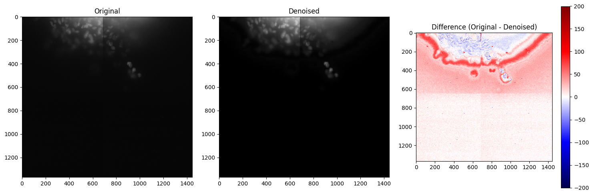

# AI4Life-OC-3DM3
Python tools for stitching, denoising (Noise2Void), and analyzing 5D microscopy data of tumor spheroids in collagen. Developed as part of the AI4Life Open Call 3 project.

---

## 🧪 Environment Setup (Windows + NVIDIA GPU)

This repo uses [Noise2Void (n2v)](https://github.com/juglab/n2v) for denoising.

To replicate the working GPU-enabled environment on Windows (with TensorFlow 2.10.1), you can use the included `n2v_env.yaml`:

```bash
conda env create -f n2v_env.yaml
conda activate n2v
```

⚠️ This setup uses `cudatoolkit=11.2` and `cudnn=8.1.0` from `conda-forge`, matching **TF 2.10 GPU** requirements.
💡 If you're using a different system or encounter issues, check the official n2v installation guide for up-to-date instructions.

If you're using a **different system** or encounter issues, check the official [n2v installation guide](https://github.com/juglab/n2v#installation) for up-to-date instructions.

## 🧷 Scripts and Notebooks

### 1. **Stitching Tiles**  
📄 `stitch.py` — used to stitch together multiple tiles of raw microscopy data into unified images for processing.

### 2. **Preparing Data for N2V**  
📄 `prepare_n2v.py` — performs max Z-projection (or similar) to generate suitable 2D training input from 5D TIFFs.

### 3. **Denoising with N2V**  
📓 `notebooks/N2V_denoising.ipynb` — end-to-end notebook for:
- Setting up training parameters
- Loading 3D TIFFs (TYX or TCYX)
- Patching and training an N2V model
- Predicting on unseen data

The model is saved in:
```
./models/denoising_5slices_n2v/
```

After denoising, we compare the original and denoised images a the pixel level:



## 📎 File Structure
```
AI4Life-OC-3DM3/
│
├── models/
│   └── denoising_5slices_n2v/
│       ├── weights_best.h5
│       └── original-denoised-difference.png
│
├── data/
│   ├── raw/                 # raw stitched TIFFs
│   └── n2v_input/           # Z-projected TIFFs for denoising
│
├── notebooks/
│   └── N2V_denoising.ipynb
│
├── stitch.py
├── prepare_n2v.py
├── n2v_env.yaml
└── README.md
```

Made with 💥 by the OC-3DM³ team.