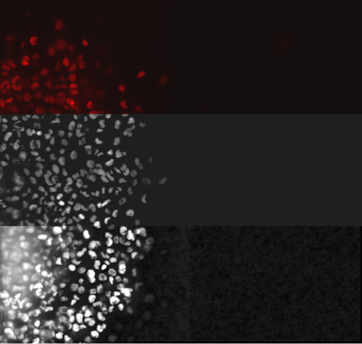

<p align="center">
  <a href="https://ai4life.eurobioimaging.eu/open-calls/">
    
  </a>
</p>

# Project 11: 3D Matrix Motility Map (3DM³)

**A collaboration with the Institute of Cell Biology and Immunology, University of Stuttgart, Germany**

---

## 🧠 Introduction

Cancer cell dissemination in 3D matrices is driven by interactions between cells and the extracellular matrix (ECM), especially collagen.  
This project focuses on live-cell imaging of breast tumor spheroids embedded in collagen to analyze cancer cell migration, shape, and interaction with ECM architecture.

The dataset includes **5D live imaging (X, Y, Z, T, C)** acquired using widefield and confocal microscopy.  
Channels include:
- **Brightfield** (cell shape)
- **mScarlet** (nuclear marker)
- **Second Harmonic Generation (SHG)** (collagen structure)

Our aim is to develop a **reproducible pipeline** for:
- Stitching tiled acquisitions
- Denoising (via N2V or Careamics)
- Manual annotation
- Cellpose finetuning
- Segmentation of migrating cells


## 🔧 Pipeline Overview

### 1. Environment Setup

To enable GPU acceleration on Windows:

```bash
conda env create -f n2v_env.yaml
conda activate n2v
```
For denoising, choose either:
* `Noise2Void` (legacy, self-supervised)
* ✅ [Careamics](https://careamics.github.io/0.1) (recommended, modular and modern implementation)

### 2. Stitching Raw Tile Images 
We begin with a 2x2 tile grid of 5D TIFF files (shape: X, Y, Z, T, C).
Stitching is done using known positional offsets.

Run:
```bash
python stitch.py
```

**Output**:
Single `.ome.tif` containing the full volume.

### 3. Preparing 2D+T Slices for Denoising

We extract the nuclei channel (mScarlet), and apply max Z-projection over central slices to obtain a 3D (T, Y, X) stack.

**Run:**

```bash
python prepare_n2v.py
```

### 4. Denoising
You can denoise using:

##### Option A: Jupyter Notebook with N2V
Open:
```bash
notebooks/N2V_denoising.ipynb
```
Run the cells, specify where your dataset lies and denoise. Remember to install the environment. 

##### Option B: Jupyter Notebook with CAREamics (Recommended)
Open:
```bash
CAREamics_denoising.ipynb
```
Again, run each cell and specify the dataset. This will need a different environment. 
For any assistance, consult [CAREamics' documentation](https://careamics.github.io/0.1).

Here you can see an image representing (from top to bottom) the original image, the image after being properly stitched and preprocessed and after denoising with CAREamics. 



### 5. Cell Annotation and Training

#### 5.1 Manual Annotation
Use the Cellpose GUI for annotation:
```bash
python -m cellpose --Zstack
```

Save training pairs like:
```text
segmentation_input/training/
├── nuclei_t003.tif
├── nuclei_t003_seg.npy
```

To have a consisten training of cellpose you will need to annotate between 15-20 nuclei per time-point and multiple time-points per scene. If not, there is not enough data to fine-tune cellpose. 

For more information on how to annotate images read [this docs](https://cellpose.readthedocs.io/en/latest/gui.html) and [this blog post](https://focalplane.biologists.com/2025/06/05/annotating-images-in-cellpose/).

### 5.2 Training Custom Cellpose Model

We use a batch file to launch training from these annotation pairs.

**File to run:**  
```
scripts/train_cellpose.bat
```
This runs Cellpose training with:
- base model: `nuclei`
- 50 epochs
- batch size 8
- grayscale channel (chan=0)

Trained model is saved to:

```
models/cellpose_nuclei_model/nuclei_custom/
```

**Acknowledgements**

AI4Life has received funding from the European Union’s Horizon Europe research and innovation programme under grant agreement number 101057970. Views and opinions expressed are however those of the author(s) only and do not necessarily reflect those of the European Union or the European Research Council Executive Agency. Neither the European Union nor the granting authority can be held responsible for them.
